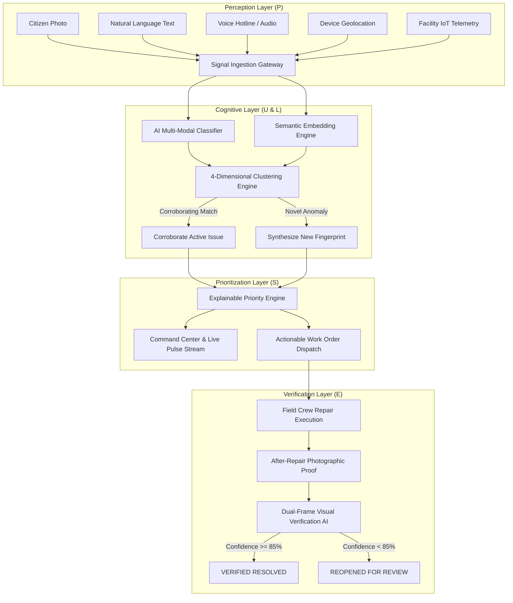
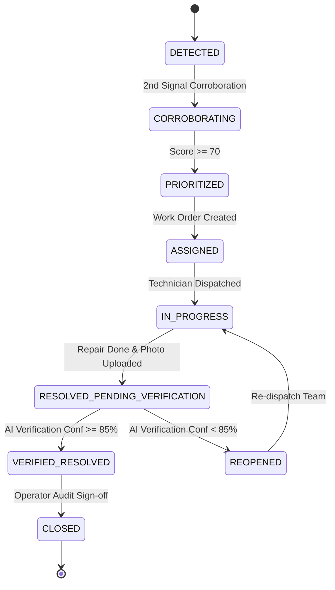

# PATCHPULSE — Architecture & Technical Specifications

**Hackathon:** HACKDAY 1.0  
**Theme:** TECH FOR A BETTER TOMORROW  
**Participant:** Pochiraju Kailash Ram Markandeya Sharma (Solo Participant)  
**Team Name:** kailashsharma8  
**Project:** PATCHPULSE — AI Civic Intelligence & Verification Platform  
**Tagline:** *Detect problems before complaints become crises.*

---

## 1. System Architecture Overview

PATCHPULSE operates as an intelligent civic perception network that replaces conventional complaint registries with an autonomous multi-modal signal fusion engine.

---

## 2. PULSE-5 Methodology

1. **P — Perceive:** Weak signals (photos, unstructured text, speech audio, coordinates, and historical current draw) are continuously indexed.
2. **U — Unify:** Rather than generating isolated duplicate complaints (#101, #102, #103), signals are evaluated against active incidents using a 4-dimensional composite score.
3. **L — Learn:** Inferences on physical severity, ambient nighttime context, proximity to student hostels, and persistent days.
4. **S — Score:** 0–100 explainable priority ranking calculated across 6 weighted dimensions with transparent, human-readable justification.
5. **E — Evidence:** Dual-frame computer vision compares "before" vs. "after" states to ensure defects are physically rectified before closing.

---

## 3. Mathematical Foundations

### 3.1 Multi-Dimensional Clustering Equation
For an incoming report $R$ and active candidate issue $I$:

$$\text{ClusterScore}(R, I) = w_{\text{sem}} \cdot S_{\text{semantic}} + w_{\text{loc}} \cdot S_{\text{location}} + w_{\text{cat}} \cdot S_{\text{category}} + w_{\text{time}} \cdot S_{\text{temporal}}$$

Where:
- $w_{\text{sem}} = 0.45$, $w_{\text{loc}} = 0.30$, $w_{\text{cat}} = 0.15$, $w_{\text{time}} = 0.10$
- $S_{\text{semantic}} = \cos(\vec{v}_R, \vec{v}_I) = \frac{\vec{v}_R \cdot \vec{v}_I}{\|\vec{v}_R\| \|\vec{v}_I\|}$
- $S_{\text{location}} = \max\left(0, 1 - \frac{d_{\text{haversine}}(R, I)}{R_{\text{max}}}\right)$ with $R_{\text{max}} = 150\text{m}$
- $S_{\text{temporal}} = \exp\left(-\frac{\Delta t}{72\text{ hours}}\right)$
- Threshold: $\text{ClusterScore} \ge 0.78 \implies \text{Deduplicated Merge}$

### 3.2 Explainable Priority Formula

$$\text{PriorityScore} = 0.25 \cdot \text{Severity} + 0.20 \cdot \text{Impact} + 0.15 \cdot \text{Persistence} + 0.15 \cdot \text{Confidence} + 0.15 \cdot \text{Vulnerability} + 0.10 \cdot \text{Urgency}$$

Priority Bands:
- **CRITICAL:** 75 – 100
- **HIGH:** 55 – 74
- **MEDIUM:** 30 – 54
- **LOW:** 0 – 29

---

## 4. Controlled Issue Lifecycle State Machine

---

## 5. Security & Privacy Architecture
- **Password Hashing:** Deterministic salted cryptographic digests.
- **JWT Authentication:** Role-based access control (`CITIZEN`, `OPERATOR`, `ADMIN`).
- **Anonymous Reporting:** Citizens can submit signals without forced public exposure of identity.
- **Data Protection:** No personal contact details exposed in public issue feeds.
